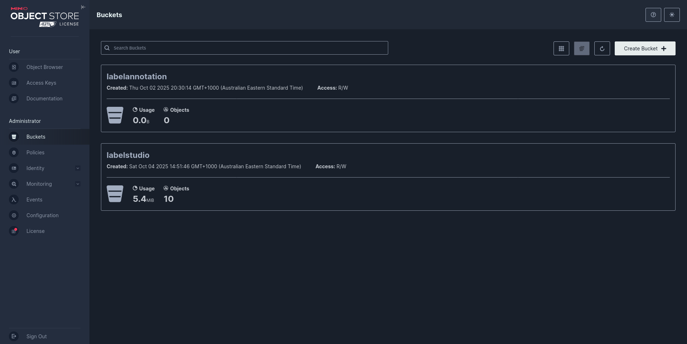
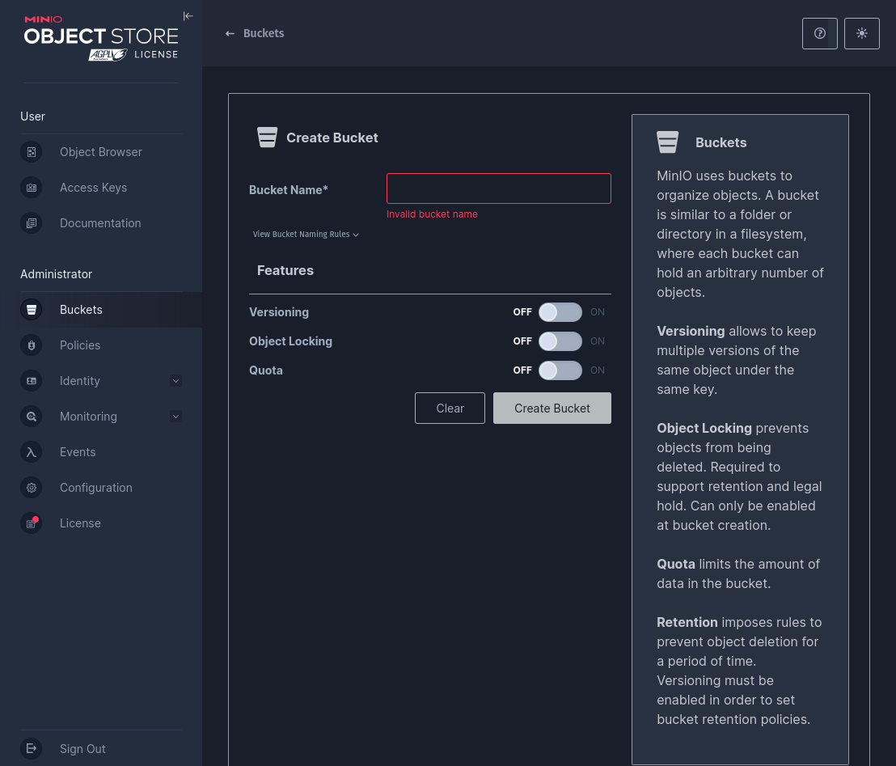
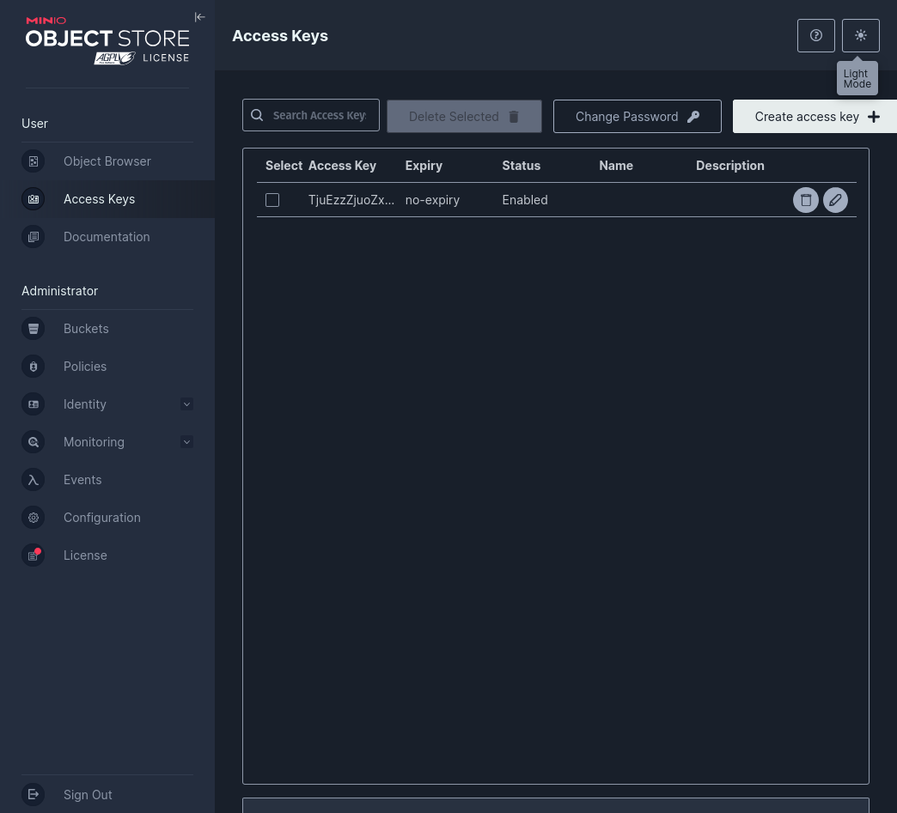
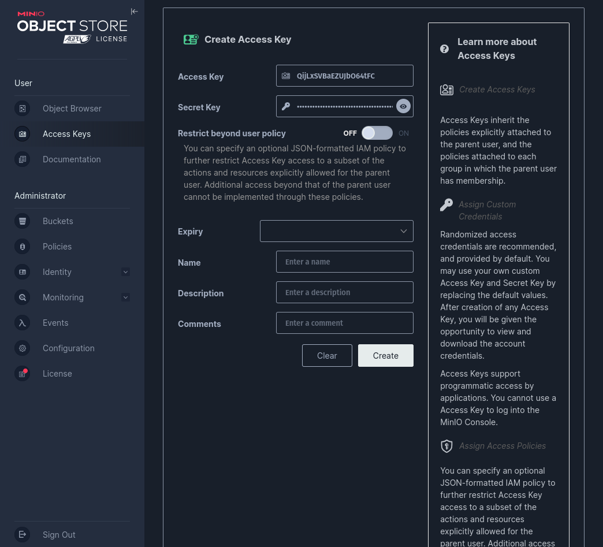
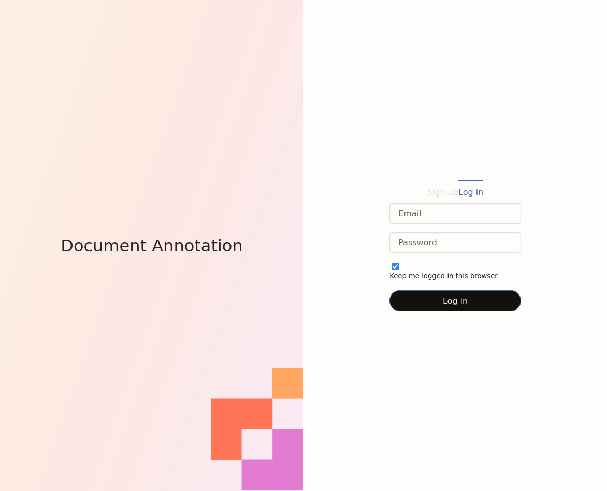

# Document Annotation Tool

### Install for local development

> Prerequisite

```bash

docker compose -f docker-compose.minio.prod.yml up -d minio

``` 

1. Set Up MINIO Storage 



- First Navigate to Buckets in the left nav bar
- Click Create Buckets to create a new object storage for Document Annotation tool



- Choose your bucket name and click Create Bucket



- Next choose Access Key on the left nav bar 
- Then click on the Create Access Key


- Record Your new Access Key and Secret Key 

At .env.list
```dotenv
MINIO_STORAGE_BUCKET_NAME=<your new bucket name>
MINIO_STORAGE_ACCESS_KEY=<your access key>
MINIO_STORAGE_SECRET_KEY=<your secret key>
```
You can run the latest Document Annotation via docker. 

```bash

docker compose -f docker-compose.minio.prod.yml up -d
```

wait for 30s - 60s for initialization process to finished
you access the tool via 
http://localhost:8080



You can start access the tool using the chosen admin and super account that 
setted in the .env.list

```dotenv
DJANGO_INITIAL_USER_EMAIL=admin@example.com
DJANGO_INITIAL_USER_PASSWORD=adminpassword123

DJANGO_SUPERUSER_EMAIL=superadmin@example.com
DJANGO_SUPERUSER_PASSWORD=superpassword123
```